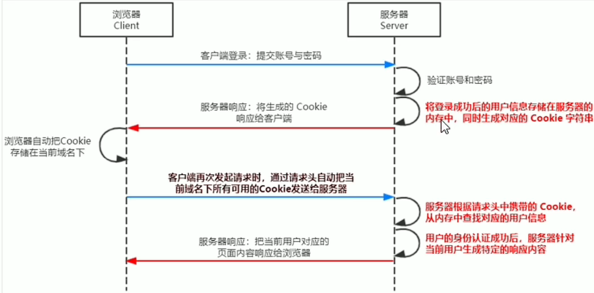
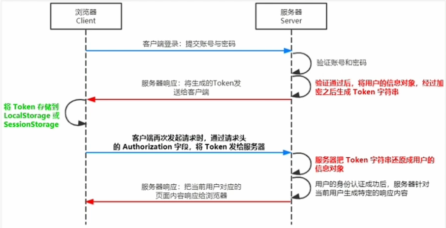

#### 身份认证

- web:手机验证登录,账号密码登录

- 服务器渲染:推荐使用Session认证机制
- 前后端分离:推荐使用JWT认证机制

#### Session认证机制

- http的无状态性

  - 客户端的每次HTTP请求都是独立的,连续多个请求之间没有直接的关系,服务器不会保留每次HTTP请求的状态.

- 突破HTTP无状态性质

  - 会员卡身份认证方式:web中专业术语叫Cookie
  - Cookie是存储在用户浏览器中一段不超过4kb的字符串,它由一个名称(name),一个值(value)和其他几个用于控制Cookie有效期,安全性,使用范围的可选属性组成.
  - 不同域名下的Cookie各自独立,每当客户端发起请求时,会自动把当前域名下所有未过期的Cookie一同发送到服务器.
  - Cookie特性
    - 自动发送
    - 域名独立
    - 过期时限
    - 4KB限制
  - Cookie在身份认证中的作用
    - 客户端第一次请求服务器的时候,服务器通过响应头的形式,向客户端发送一个身份认证的Cookie,客户端自动将Cookie保存在浏览器中.
    - 当客户端浏览器每次请求服务器的时候,浏览器自动将身份认证相关的Cookie通过请求头的形式发送给服务器,服务器即可验明客户端的身份.

- Cookie不具有安全性

  - Cookie存储在浏览器,浏览器提供读写Cookie的API,因此Cookie很容易被伪造,不具有安全性
  - 不能使用Cookie存重要且隐私的数据,身份信息,密码等

- 提高身份认证的安全性

  - "会员卡+刷卡认证"设计理念,就是Session认证机制的精髓

- Session工作原理

  

#### JWT认证机制

- 当前端请求接口不存在跨域问题时,推荐使用Session身份认证机制
- 当前端需要跨域请求后端结构时,不推荐使用Session身份认证机制,推荐使用token认证机制
- (JSON Web Token)目前最流行的跨域认证解决方案

- jwt和session区别
  - session将用户信息存在服务器**内存**,生成cookie返回给客户端,客户端发起请求时把所有有效的cookie发给服务器端,客户端根据cookie查找用户信息,服务器针对用户信息生成内容响应.
  - jwt将用户信息经过加密之后生成token字符串,将token存储在**LocalStorage或SessionStorage(客户端)**,客户端发起请求时通过请求头的Authorization字段,将token发给服务器,服务器将token字符串还原成用户的信息对象,再响应给浏览器.
- jwt
  - Header.Payload.Signature  //头部,有效荷载,签名
  - payload为真正的用户信息,它是用户信息经过加密之后生成的字符串
  - header和signature时安全性相关的部分,只是为了保证token的安全性
  - jwtwebtoken用于生成jwt字符串
  - express-jwt用于将jwt字符串解析还原成json对象
- jwt密钥
  - 为了保证jwt字符串的安全性,防止jwt字符串在网络传输过程中被别人破解,需要专门定义一个用于加密和解密的secret密钥
    - 当生成jwt字符串的时候,需要使用secret密钥对用户的信息进行加密.最终得到加密后的jwt字符串
    - 当把jwt字符串解析还原成json对象的时候,需要使用secret密钥进行解密